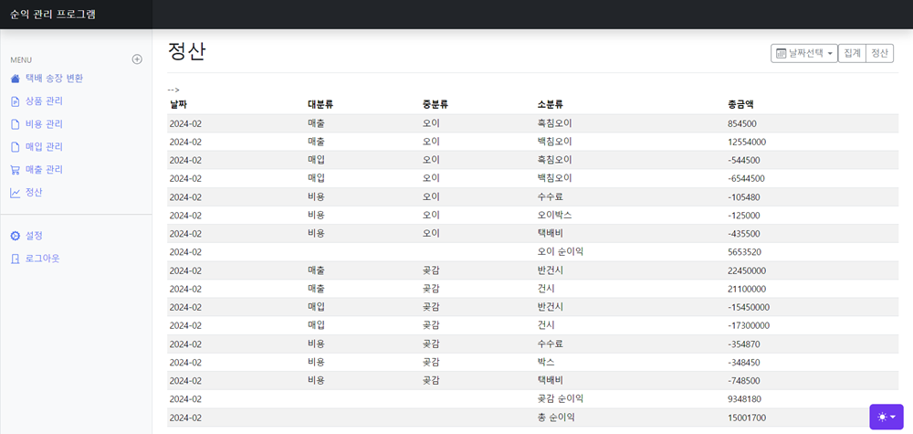
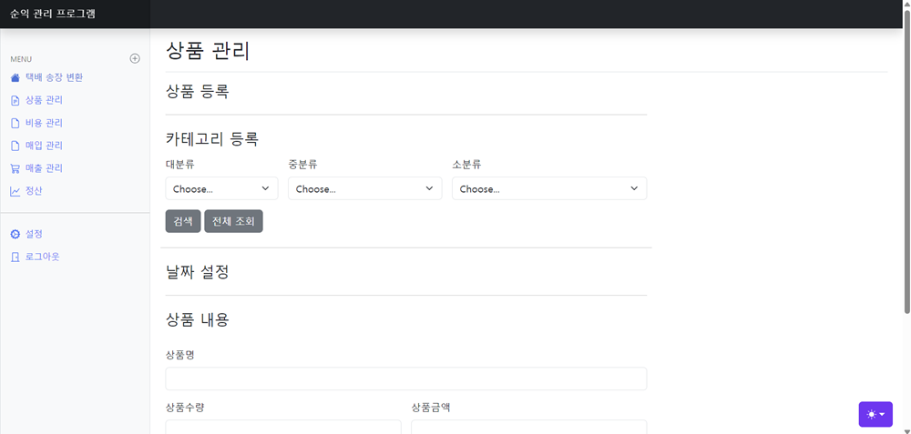
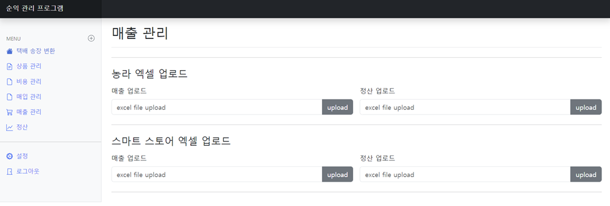
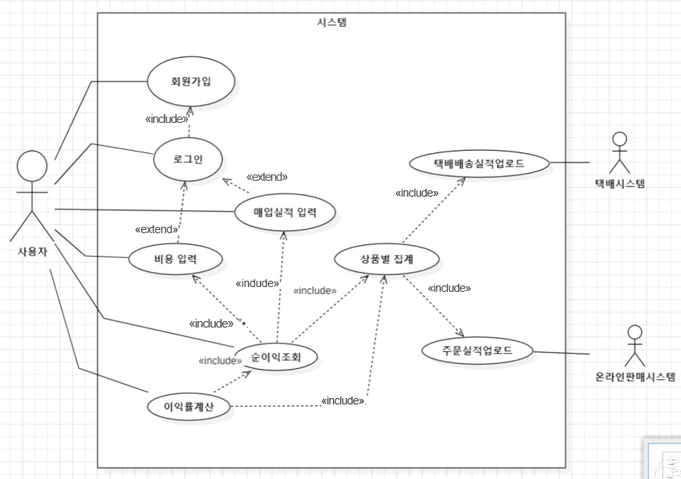
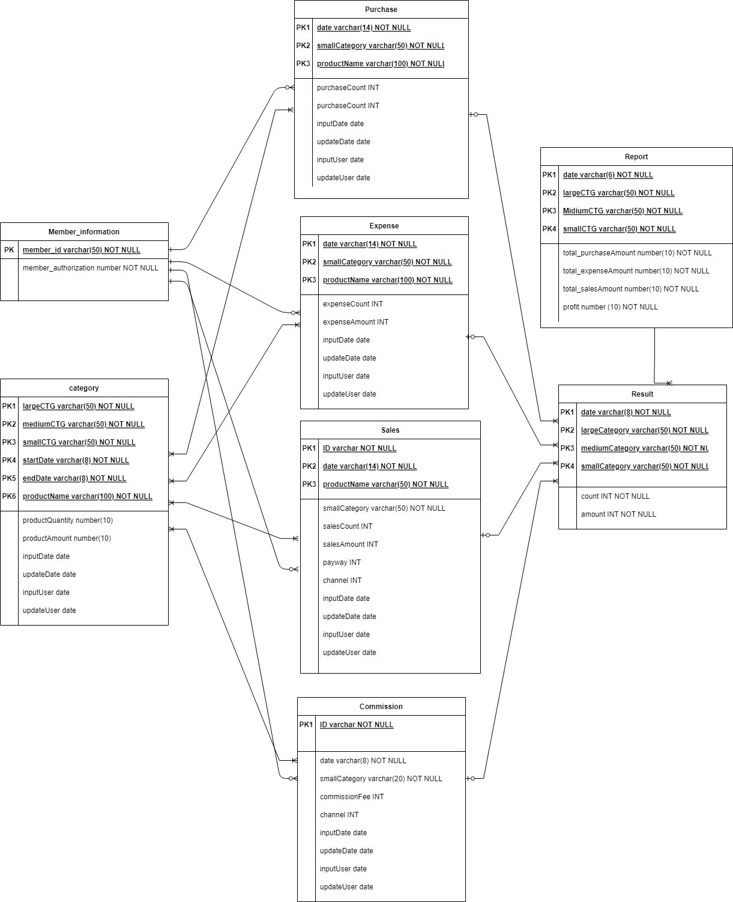

# ✨ 순익 관리 프로그램

### 📢 [배포 사이트 바로가기 - [ 바로가기 - 미정( 프론트 연동 중 ) ]]

## ✨ 프로젝트 소개

### [ 프로젝트 간단 소개 ]

- 본 프로젝트는 온라인 판매 순익 관리 프로그램입니다. 다양한 온라인 플랫폼에서 판매하는 상품을 간단한 데이터 입력과 엑셀 데이터 업로드를 통해 통합된 매출과 비용 및 순이익들을 산출합니다. 기간별 그리고 상품 분류 별로 매출과 순이익에 대한 결과를 조회할 수 있으며 이 기능들을 통해 업체는 판매 상품 순이익을 확인할 수 있습니다. 또한 매년 세금 신고시, 가계부 작성 및 세금 신고에도 유용합니다.
  
   

### [ 프로젝트를 처음 기획을 생각한 이유 ]

- 온라인 유통 사업을 하시는 부모님을 도와 드리며 매출액 증가와 함께 매출관리에 어려움을 겪었습니다. Excel로 매일 한 시간씩 각 플랫폼에서 판매한 제품들을 정리하여 순이익을 계산하니 시간도 오래 걸리고 부모님께서 업무를 보기 힘들어 하셨습니다. 처음에는 기존에 만들어진 솔루션 소프트웨어를 알아보았으나, 다양한 플랫폼에서 발생한 매출을 통합 해주는 프로그램이 있었지만 순이익을 계산해 주거나 엑셀을 업로드해서 산출하는 프로그램이 없었습니다. 그래서 회계 업무의 효율성을 위해 비지니스에 맞는 순익 관리 프로그램을 직접 개발하기로 하였습니다.

   

### [ 프로젝트를 완성할 수 있었던 이유 ]

- 본 프로젝트는 실제 사업체에서 사용하기 위해 개발한 프로그램으로 기존 비지니스에 대한 정확한 이해를 바탕으로 원하는 기능을 구현했습니다. 프로젝트를 진행하면서 가장 크게 느낀점은 ERD 설계의 중요성이었습니다. 효율적인 데이터 모델링을 기반으로 개발을 수행했을때 데이터의 추출이나 집계를 정확히 할 수 있었습니다. 학교 선배님 중에 ERP 관련 업무를 하시는 분들께 조언을 구하며 프로젝트를 잘 마무리 할 수 있었습니다. 

   

## 👨‍기술 스택

<h3 align="center">어플리케이션</h3>

<h3 align="center">DB</h3>

  

<h3 align="center">인프라</h3>

   

<h3 align="center">문서 / 협업</h3>

   

 

## 🔎 프로젝트 화면

## 🎨 UseCase Diagram

## 🎨 ERD Diagram

 
